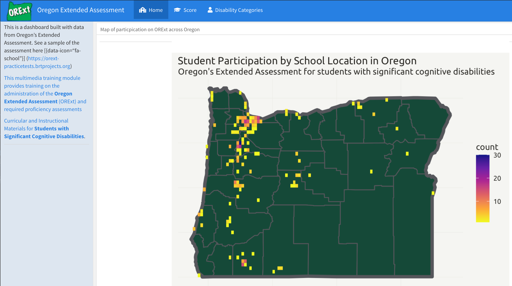
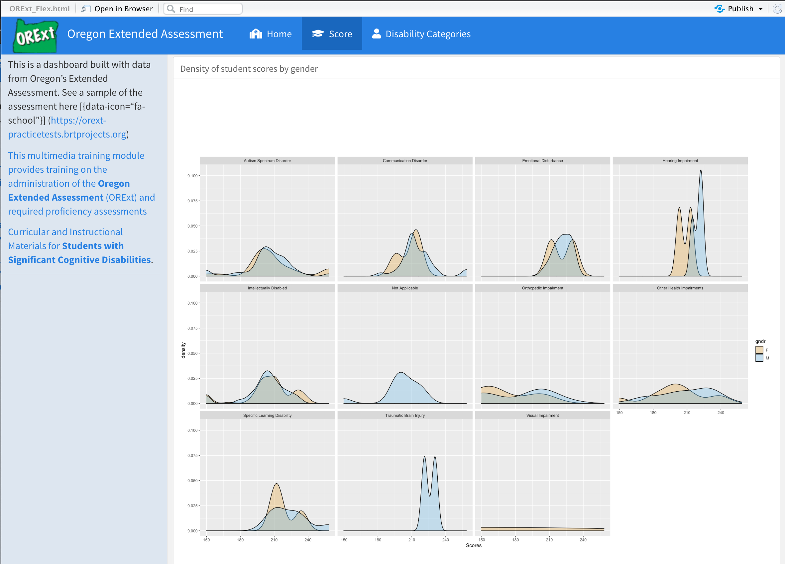
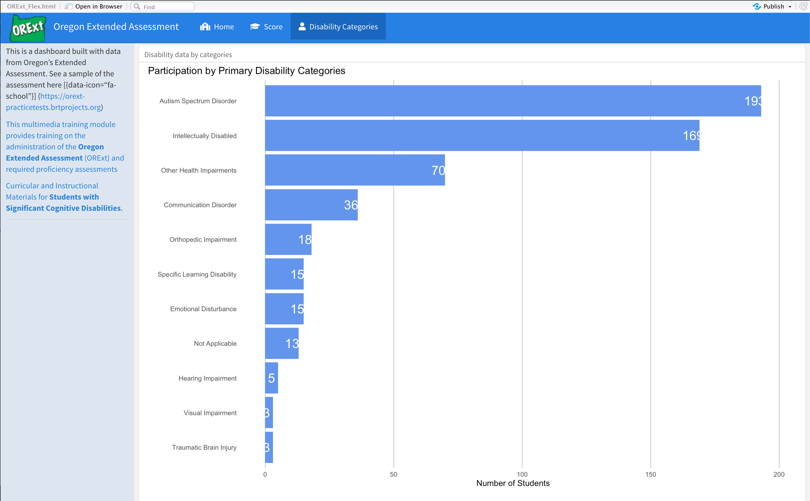
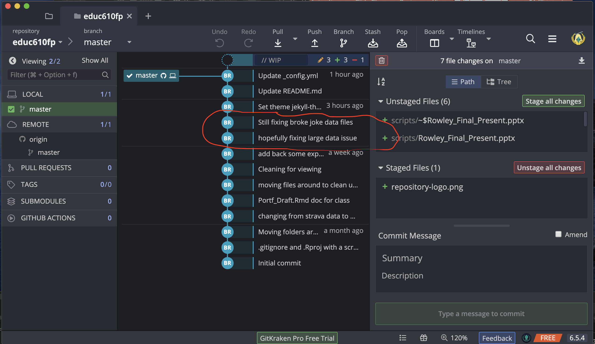
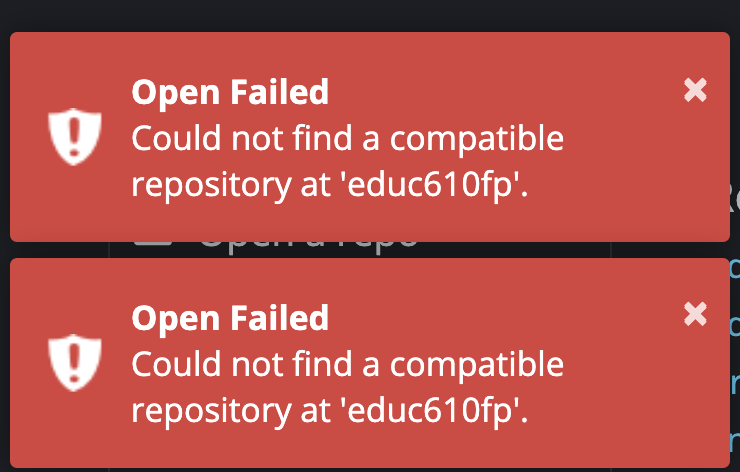
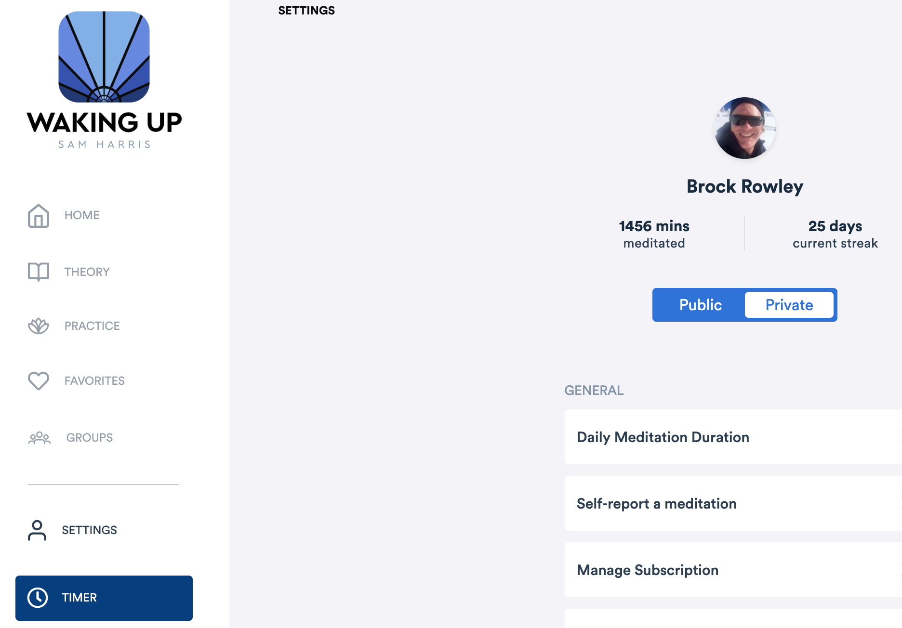

#  Briefly show each visualization 

---
#  Briefly show each visualization 

---

---
#  Pick 1 and Discuss:Intended audience = ODE, Participating Schools, Other States. Design choices, e.g. Colors = DucksLayout Choice of specific type of plot = Geospatial 

+ Pick one, go more in-depth, and discuss:
+ Intended audience =	Design choices =		Colors =		Layout =		Choice of specific plot =

---

---
class: inverse
background-image: url('assets/img/image6.png')
background-size: cover

---
class: inverse
background-image: url('assets/img/image5.png')
background-size: cover

---
class: inverse
background-image: url('assets/img/image7.png')
background-size: cover

---
#  At least 1 major challenge encountered along the way 

.pull-left[]

.pull-right[]

---
#  At least 1 major victory 

